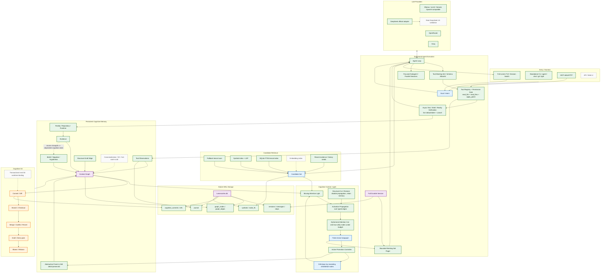
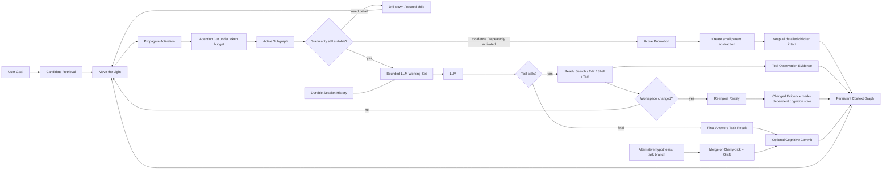

# Architecture diagrams

These diagrams distinguish the **target architecture** from the **current implementation**.

Legend:

- solid green/blue/orange: implemented and covered by automated tests;
- dashed gray: planned or only partially represented;
- "attention cut" means removing nodes from the **current working set**, not deleting durable graph memory.

## Target system architecture



## Working principle



## The four key operations

```text
1. Propagation  传导
   Seed nodes -> typed edges -> decayed activation -> candidate attention

2. Cut / Amputation  截肢
   Ephemeral cut: candidate -> token budget -> omit from this working set.
   Structural cut: edge cut -> propagation stops while node/edge/history remain restorable.
   IMPORTANT: neither form requires deleting durable cognitive memory.

3. Graft  嫁接
   Structural graft: add an explicit typed graph edge between existing cognition.
   Branch graft: merge/cherry-pick another cognition branch into current history.

4. Promotion  升格
   Dense/reused detail -> parent abstraction
   children remain intact -> future drill-down is possible
```

## Long-task invariant

```text
Persistent graph/session may grow without bound
                |
                v
        Light moves every step
                |
                v
      finite Active Subgraph
                |
                v
       finite Working Set
                |
                v
              LLM

The model never needs the entire durable history in every request.
```
