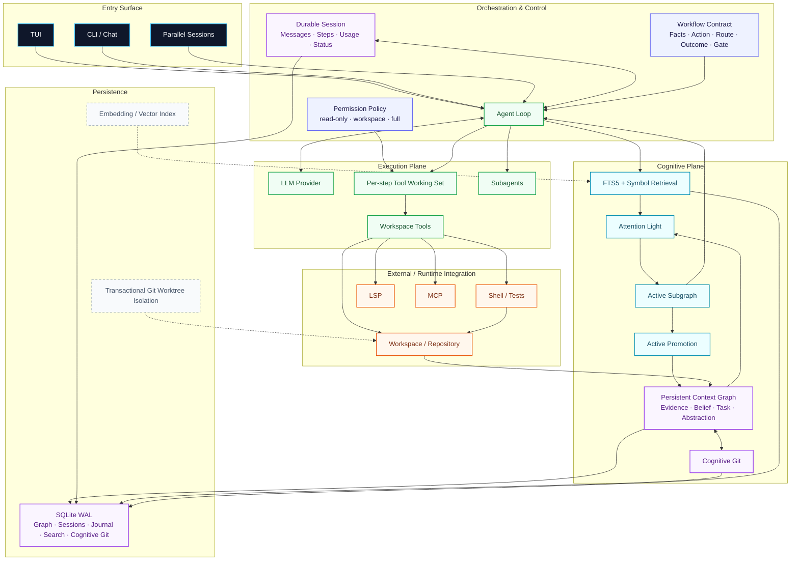
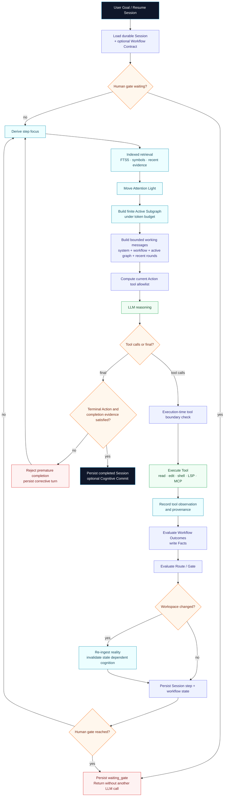
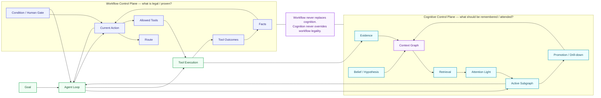
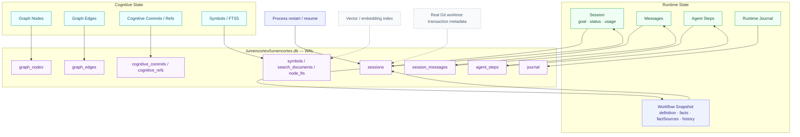

# Architecture diagrams

This file is the visual architecture index.

Reusable Mermaid sources are stored under `docs/diagrams/`.

## Legend

- navy: entry/user surface,
- indigo: Workflow and policy control,
- cyan: cognitive retrieval/attention,
- green: execution,
- orange: host/external integration,
- purple: durable persistence,
- dashed gray: planned/incomplete.

## System architecture

Question answered:

> What are the major runtime layers, and how do they interact?



Source: `docs/diagrams/system-architecture.mmd`.

## Agent execution logic

Question answered:

> What exactly happens from a user goal until completion, pause, or resume?



Source: `docs/diagrams/agent-execution-flow.mmd`.

See [Execution flow](execution-flow.md) for step-by-step semantics.

## Workflow and Cognitive Graph dual control plane

Question answered:

> Why are Workflow Contract and Context Graph separate instead of being one graph?



Source: `docs/diagrams/workflow-cognitive-dual-plane.mmd`.

The invariant is:

```text
Workflow: what is legal / proven
Cognition: what is remembered / attended
Execution: what actually happens
```

## Persistence and data flow

Question answered:

> What survives process restart and where is it stored?



Source: `docs/diagrams/persistence-data-flow.mmd`.

## Long-task invariant

```text
Durable Session + Context Graph may grow
                 │
                 ▼
      retrieval narrows candidates
                 │
                 ▼
       Attention Light moves
                 │
                 ▼
        finite Active Subgraph
                 │
                 ▼
       bounded recent tool rounds
                 │
                 ▼
             finite LLM input
```

LumenCortex does not require the entire durable history to be sent to the model every turn.

## Implementation vs target

The diagrams intentionally show planned components as dashed gray.

Currently important planned/incomplete items include:

- transactional real Git worktree isolation,
- vector/embedding retrieval,
- whole-run rollback for arbitrary workspace mutations,
- richer Skills/vision/browser layers.

For claim status, use [Standalone readiness](standalone-readiness.md), not the diagram alone.
