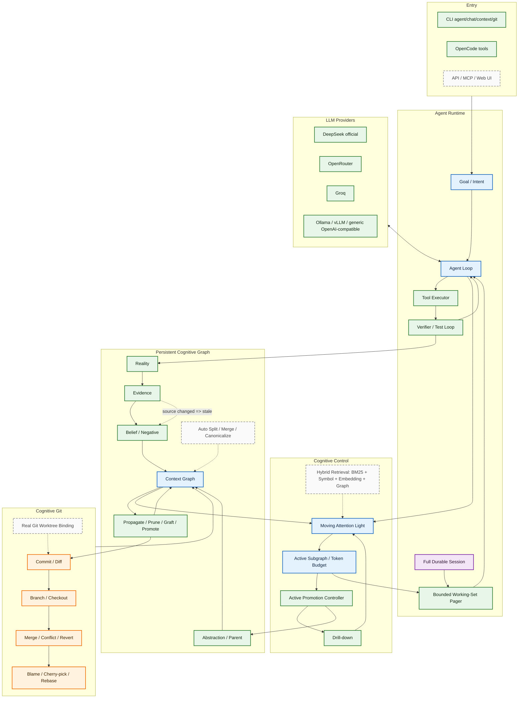
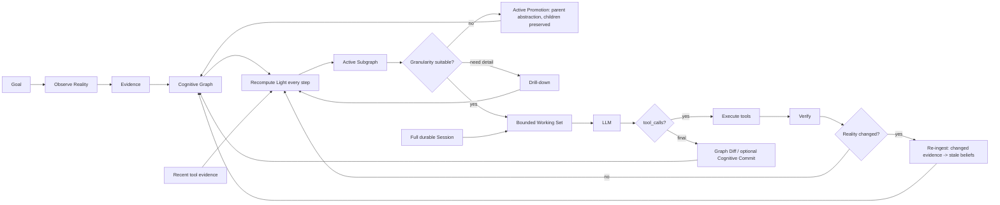

# Architecture diagrams

Solid boxes are implemented/tested core capabilities. Dashed boxes are planned/partial capabilities.

## System architecture

## Working principle

Core invariant:

> Durable history may keep growing; the active model attention must remain finite.
