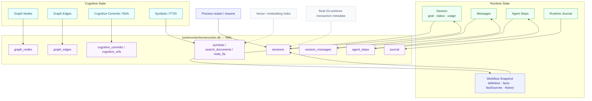

# Data model

This document describes conceptual and persistent state.

## State domains

LumenCortex deliberately separates:

1. Cognitive state,
2. Session/execution state,
3. Workflow state.

Workflow state is persisted through Session metadata rather than a second database subsystem.

## Cognitive Graph state

Conceptual graph snapshot:

```json
{
  "version": 1,
  "nodes": {},
  "edges": {},
  "metadata": {}
}
```

## Node

Common fields:

```json
{
  "id": "node_...",
  "kind": "belief",
  "title": "Submission does not deduct inventory",
  "body": "...",
  "tags": [],
  "status": "active",
  "trustZone": "model_inferred",
  "grade": "static",
  "createdAt": "...",
  "updatedAt": "...",
  "version": 1,
  "metadata": {}
}
```

Optional fields include:

- `evidenceIds[]`,
- `childIds[]`,
- `unresolved[]`,
- `source`,
- `observedAt`,
- `ttlMs`,
- `contentHash`,
- `sourceVersion`,
- `validity`.

## Edge

```json
{
  "id": "edge_...",
  "from": "node_a",
  "to": "node_b",
  "type": "depends_on",
  "weight": 0.9,
  "createdAt": "...",
  "metadata": {}
}
```

Current relation vocabulary includes:

```text
depends_on
derived_from
relates_to
supersedes
abstracts
invalidates
contradicts
verifies
causes
calls
affects
```

## Evidence grade

Evidence grade represents provenance/verification level, not model probability.

| Grade | Meaning |
|---|---|
| `hypothesis` | unverified reasoning |
| `static` | supported by source/static evidence |
| `tested` | supported by a test |
| `runtime` | observed in runtime state |
| `reproduced` | independently reproduced |

A belief or negative node above `hypothesis` must cite evidence.

An evidence node cannot use `model_inferred` as its trust zone.

## Session

A durable Agent Session conceptually contains:

```json
{
  "id": "session_...",
  "createdAt": "...",
  "updatedAt": "...",
  "status": "running",
  "provider": "generic",
  "model": "qwen3:4b-instruct",
  "goal": "...",
  "messages": [],
  "steps": [],
  "metadata": {},
  "usage": {}
}
```

Persisted Session data includes:

- complete message history,
- Agent step records,
- tool calls,
- global step numbering,
- cumulative usage,
- context-history snapshots,
- promotion history,
- recent observation IDs,
- final/error status,
- Workflow snapshot when active.

## Workflow snapshot

Stored under `session.metadata.workflow`:

```json
{
  "version": 1,
  "definition": {
    "id": "verified-code-fix",
    "actions": {}
  },
  "currentAction": "verify",
  "facts": {
    "tests": {
      "failed": true,
      "passed": false
    }
  },
  "factSources": {
    "tests.failed": {
      "source": "tool",
      "tool": "shell",
      "step": 1,
      "outcome": "baseline-fails"
    }
  },
  "history": [],
  "status": "running"
}
```

Workflow state is compact task-control state. Large evidence remains in Session messages and/or Context Graph observations.

## Agent step

A step persists enough runtime evidence to reconstruct the run:

- step number,
- timestamp,
- focus,
- selected cognitive context IDs,
- context token use,
- promotion ID,
- finish reason,
- assistant content,
- tool-call summaries,
- optional ingest stats,
- Workflow summary when active.

## Cognitive commit

```json
{
  "id": "...",
  "message": "...",
  "parents": ["..."],
  "createdAt": "...",
  "graphHash": "...",
  "diff": {
    "operations": []
  },
  "metadata": {}
}
```

Cognitive commits store diffs rather than a complete graph snapshot per commit.

Sparse SQLite checkpoints are persisted approximately every 50 first-parent commits to bound reconstruction cost.

## SQLite persistence

Canonical file:

```text
.lumencortex/lumencortex.db
```

WAL companions:

```text
lumencortex.db-wal
lumencortex.db-shm
```

Important logical table groups:

### Cognitive graph

- `graph_nodes`,
- `graph_edges`.

### Cognitive Git

- `cognitive_commits`,
- `cognitive_refs`,
- sparse checkpoint storage.

### Sessions

- `sessions`,
- `session_messages`,
- `agent_steps`.

### Retrieval

- `search_documents`,
- `symbols`,
- FTS5 `node_fts`.

### Runtime

- `journal`.

## Persistence data flow



Source: `docs/diagrams/persistence-data-flow.mmd`.

## Incremental persistence

Routine graph mutations carry mutation hints so persistence can update affected node/edge rows and dirty search IDs instead of scanning/replacing the full graph.

Session growth is also persisted incrementally rather than replacing the entire Session history on every step.

## Legacy migration

Pre-v0.6 JSON repositories are imported once on open and archived after successful migration.

## Planned data-model additions

Not yet canonical:

- vector/embedding index,
- real Git worktree transaction metadata,
- hot/warm/cold graph tiers,
- richer temporal validity indexing.
