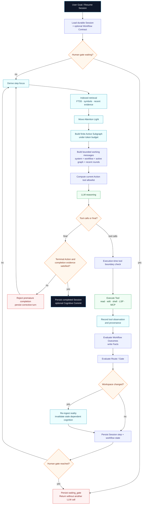

# Agent execution flow

This document describes the runtime logic of one autonomous Agent run, including Workflow Contracts, cognitive retrieval, tool execution, mutation, persistence, cancellation, and resume.

## End-to-end logic



Source: `docs/diagrams/agent-execution-flow.mmd`.

## 1. Start or resume

A run begins with either:

- a new user goal, or
- an existing Session ID.

A new Session stores the goal, provider/model, messages, runtime options, and optional Workflow definition.

A resumed Session restores:

- complete durable messages,
- global step numbering,
- cumulative usage,
- context history,
- recent observation IDs,
- promotion history,
- Workflow snapshot if present.

If a resumed Workflow definition is supplied and differs from the definition stored in the Session, the run fails closed instead of silently switching contracts.

## 2. Human Gate check

Before spending another model request, the runtime checks whether the current Workflow Action is waiting for human approval.

If so:

```text
status = waiting_gate
persist Session
return control to caller
do not make another LLM request
```

Approval is an explicit state mutation:

```bash
lcx workflow approve SESSION_ID GATE_ID --actor NAME
```

The approval becomes a Fact with human provenance.

## 3. Derive focus

The Agent derives the current focus from:

- the stable Session goal,
- current step,
- recent tool calls,
- paths/queries/commands used by recent tools,
- current Workflow Action when active.

This focus is a retrieval/attention input, not a durable truth claim.

## 4. Candidate retrieval

The normal retrieval path uses:

1. symbol index,
2. SQLite FTS5,
3. recent observation/history seeds,
4. graph neighborhood propagation.

Embedding retrieval is planned as an optional additional recall channel.

The purpose of retrieval is to avoid full-graph lexical scanning on every step.

## 5. Move Attention Light

Attention combines relevance and graph structure to produce a finite Active Subgraph.

Important distinction:

- persistent graph size may continue growing,
- Active Subgraph size is bounded,
- recent chat history is separately bounded by the Working-Set Pager.

This is the core long-task invariant.

## 6. Active Promotion

When selected detail becomes dense or repeatedly useful, the Promotion Controller can create a smaller parent abstraction.

Promotion is non-destructive:

```text
detail A ─┐
detail B ─┼─> parent abstraction
detail C ─┘

children remain available for drill-down
```

Promotion changes cognitive granularity; it is not equivalent to deleting history.

## 7. Build the model working set

A model request contains a bounded set:

```text
system policy
+ current cognitive Active Subgraph
+ active Workflow Contract summary
+ stable user goal
+ recent complete assistant/tool rounds
+ current allowed tool schemas
```

The full durable Session is not replayed wholesale.

## 8. Tool Working Set

When a Workflow is active, the tool set is the intersection of:

```text
Agent --tools allowlist
        ∩
current Workflow Action allowedTools
```

The provider therefore sees only the legal current tool schemas.

This is only the first enforcement point.

## 9. Execution-time enforcement

Every individual tool call is checked again immediately before execution.

This matters when one assistant turn contains multiple tool calls:

```text
call A
  ↓
Outcome writes Fact
  ↓
Route transitions Action
  ↓
call B is checked against the NEW Action
```

A tool that became illegal after call A is denied even though the model requested it earlier in the same turn.

## 10. Tool result and cognitive observation

Tool results are returned to the model and may also become durable cognitive observation nodes.

Typical trust:

- shell/runtime observation → `runtime_verified`,
- repository file observation → `repo_trusted`,
- model-only reasoning → `model_inferred`.

Workflow state and cognitive evidence are updated independently.

## 11. Workflow Outcome evaluation

After a tool result, the active Action evaluates its Outcomes.

Example:

```json
{
  "when": {
    "all": [
      { "tool": "shell" },
      { "arg": "command", "contains": "test" },
      { "result": "exitCode", "equals": 0 }
    ]
  },
  "set": {
    "tests.passed": true
  }
}
```

The Fact stores provenance in `factSources`.

## 12. Route and Gate evaluation

Facts may make an Action complete and select a Route to the next Action.

Condition Gates are evaluated automatically.

Human Gates pause the Session.

Automatic Route loops have a bounded transition guard and fail closed rather than silently spinning forever.

## 13. Workspace mutation and re-ingestion

If a successful tool reports workspace mutation and auto-ingest is enabled:

1. workspace reality is re-ingested,
2. changed source evidence is detected,
3. dependent cognition can become stale,
4. the search index is incrementally synchronized.

The current architecture does not yet provide whole-run worktree rollback for arbitrary shell mutations.

## 14. Completion Gate

A model final answer is not sufficient evidence when a Workflow is active.

The final answer is accepted only when:

```text
current Action is terminal
AND
completeWhen is satisfied
AND
all Gates are satisfied
```

Otherwise the runtime:

1. persists the premature assistant answer,
2. appends a corrective Workflow message,
3. emits `workflow.blocked_final`,
4. continues the Agent loop.

## 15. Persist and finish

On successful completion:

- Session status becomes `completed`,
- final response and usage are saved,
- Workflow state is saved,
- the task may be recorded into the cognitive graph,
- an optional Cognitive Commit can be created.

## Cancellation

One-shot Agent and Chat bridge `SIGINT` / `SIGTERM` to an `AbortSignal`.

TUI uses the same cancellation concept with `Ctrl+C`.

Cancellation behavior:

```text
signal
  ↓
provider / shell abort
  ↓
Session status = interrupted
  ↓
error metadata + usage persisted
  ↓
Session remains resumable
```

## Parallel and Subagent execution

Focused Subagents use durable Sessions.

Parallel write-capable work is guarded because real Git worktree isolation is not yet implemented. Multiple mutating tasks require explicit unsafe parallel mode or serialization.

## Failure modes

| Failure | Runtime behavior |
|---|---|
| provider retryable error | bounded retry/backoff |
| malformed/truncated tool-call JSON | retry with expanded output budget where applicable |
| empty assistant turn | bounded recovery attempt |
| unknown/out-of-working-set tool | deny |
| Workflow-illegal tool | deny |
| premature Workflow completion | reject final and continue |
| human gate | persist `waiting_gate`, stop LLM requests |
| unsafe Workflow path | fail closed |
| automatic Route cycle | fail closed |
| cancellation | persist `interrupted` |
| max steps | persist `max_steps`, throw resumable error |
