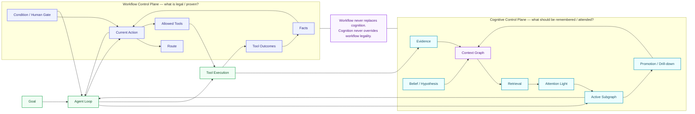

# Workflow Contract

The Workflow Contract is LumenCortex's deterministic task-control layer.

It answers:

> What stage is the task in, which actions are legal, what evidence changes state, and what must be proven before the Agent may finish?

It is deliberately separate from the Cognitive Graph.

## Relationship to cognition



Workflow is not long-term semantic memory. Cognitive memory is not an authorization engine.

## Quick start

Validate a contract:

```bash
lcx workflow validate examples/workflows/verified-code-fix.json
```

Run an Agent under the contract:

```bash
lcx agent "fix the failing tests" \
  --workflow examples/workflows/verified-code-fix.json \
  --yes
```

Inspect a persisted Workflow:

```bash
lcx workflow status SESSION_ID
```

Approve a Human Gate:

```bash
lcx workflow approve SESSION_ID GATE_ID --actor NAME
lcx agent --session SESSION_ID --yes
```

## Schema

Top level:

```json
{
  "version": 1,
  "id": "verified-code-fix",
  "title": "Verified code repair",
  "entry": "diagnose",
  "facts": {},
  "actions": {}
}
```

### Top-level fields

| Field | Required | Meaning |
|---|---:|---|
| `version` | no | defaults to 1; unsupported versions fail |
| `id` | yes | stable Workflow identity |
| `title` | no | display title; defaults to id |
| `entry` | no | first Action; defaults to first Action key |
| `facts` | no | initial deterministic state |
| `actions` | yes | map of Action ID to Action definition |

## Action

```json
{
  "title": "Independent verification",
  "description": "Run the relevant tests.",
  "terminal": true,
  "allowedTools": ["read_file", "shell"],
  "requires": { "fact": "implementation.changed", "equals": true },
  "outcomes": [],
  "routes": [],
  "gates": [],
  "completeWhen": { "fact": "tests.passed", "equals": true }
}
```

| Field | Meaning |
|---|---|
| `title` | display title |
| `description` | human/model guidance |
| `terminal` | this Action may finish the Workflow |
| `allowedTools` | tools visible and executable in this Action; null means no additional Workflow restriction |
| `requires` | precondition for entering this Action |
| `outcomes` | tool-result rules that write Facts |
| `routes` | conditional next Action choices |
| `gates` | condition or human gates |
| `completeWhen` | evidence required for Action completion |

## Outcome

Outcome example:

```json
{
  "id": "tests-pass",
  "when": {
    "all": [
      { "tool": "shell" },
      { "arg": "command", "contains": "test" },
      { "result": "exitCode", "equals": 0 }
    ]
  },
  "set": {
    "tests.passed": true
  }
}
```

An Outcome:

1. observes the current tool, arguments, wrapper result, and parsed tool content,
2. evaluates `when`,
3. writes each dotted Fact path in `set`,
4. records provenance in `factSources`.

## Route

```json
{
  "to": "verify",
  "when": { "fact": "implementation.changed", "equals": true }
}
```

When the current Action is satisfied, the first matching Route is selected.

Routes are deterministic and ordered.

Automatic Route transitions are bounded. A cycle that keeps transitioning without external progress fails closed.

## Gates

### Condition Gate

```json
{
  "id": "quality",
  "type": "condition",
  "title": "Quality checks passed",
  "condition": {
    "fact": "quality.passed",
    "equals": true
  }
}
```

### Human Gate

```json
{
  "id": "release-approval",
  "type": "human",
  "title": "Approve release"
}
```

A Human Gate defaults to the Fact path:

```text
gates.release-approval
```

It becomes satisfied only after explicit runtime approval.

A model response cannot satisfy it.

## Condition DSL

Logical operators:

- `all`,
- `any`,
- `not`.

Selectors:

- `fact`,
- `tool`,
- `ok`,
- `arg`,
- `result`.

Comparators:

- `equals`,
- `notEquals`,
- `exists`,
- `contains`,
- `matches`,
- `in`,
- `gt`,
- `gte`,
- `lt`,
- `lte`.

### Selector semantics

#### `tool`

Matches the tool name.

```json
{ "tool": "shell" }
```

May also be an array.

#### `ok`

Matches the LumenCortex tool wrapper success flag.

Important: for shell this does not mean the child command exited zero.

#### `arg`

Reads a dotted path from tool arguments.

```json
{ "arg": "command", "contains": "test" }
```

#### `result`

Reads a dotted path from parsed tool content first, then wrapper result metadata.

```json
{ "result": "exitCode", "equals": 0 }
```

This is the correct way to prove shell command success.

#### `fact`

Reads deterministic Workflow state.

```json
{ "fact": "tests.passed", "equals": true }
```

## Runtime order

For every tool call:

```text
check tool legality
      ↓
execute tool
      ↓
record cognitive observation
      ↓
evaluate current Action Outcomes
      ↓
write Facts + provenance
      ↓
evaluate completion / Routes / Gates
      ↓
possibly change current Action
      ↓
next tool call is checked against new Action
```

The last line is important for multi-tool assistant turns.

## Completion semantics

A final model answer is accepted only if:

```text
current Action.terminal == true
AND current Action completion is satisfied
AND every Gate is satisfied
```

Otherwise LumenCortex persists the premature answer, emits `workflow.blocked_final`, appends a corrective runtime message, and continues.

## Persistence

Workflow state is persisted inside normal Session metadata.

Conceptual snapshot:

```json
{
  "version": 1,
  "definition": {},
  "currentAction": "verify",
  "facts": {},
  "factSources": {},
  "history": [],
  "status": "running"
}
```

Statuses include:

- `running`,
- `waiting_gate`,
- `blocked`,
- `ready_to_finish`.

The Session itself may additionally be `running`, `waiting_gate`, `completed`, `interrupted`, or `max_steps`.

## Definition drift protection

The original Workflow definition is persisted with the Session.

When resuming, supplying a different definition is rejected.

This prevents an in-progress task from silently changing its completion contract.

## Fact path safety

Dotted paths reject:

- `__proto__`,
- `prototype`,
- `constructor`.

This prevents prototype-pollution-style state paths.

## Example coding contract

The repository includes:

`examples/workflows/verified-code-fix.json`

Its logic is:

```text
diagnose
  require real failing test evidence
      ↓
repair
  require successful implementation mutation
      ↓
verify
  require real test exitCode == 0
      ↓
terminal completion
```

## What Workflow should not contain

Do not put into Workflow Facts:

- large source files,
- long model reasoning,
- semantic memory,
- every tool output,
- repository knowledge.

Those belong in the Cognitive Graph, Session messages, or tool observations.

Workflow Facts should remain compact deterministic task state.
